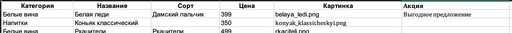

# Новое русское вино

Сайт магазина авторского вина "Новое русское вино".

## Запуск

Запускают скрипт со следующими необязательными параметрами:
    1. ```-f FILE, --file```        Файл excel с информацией для публикации на сайте
    2. ```-t TEMPLATE, --template```    Шаблон html

```
python.exe main.py -f wine.xlsx -t template.html
```	

Файл excel с информацией для публикации на сайте должен иметь следующий формат:


Инициализируются следующие переменные окружения в env файле:
- `SERVER_IP` - IP адрес сервера [http://127.0.0.1](http://127.0.0.1:8000).
- `SERVER_PORT` - Порт сервера [8000](http://127.0.0.1:8000).


## Установка

Python3 должен быть установлен. Используйте pip (или pip3, если есть конфликт с Python2) для установки зависимостей:

```
pip install -r requirements.txt
```


## Цели проекта

Код написан в учебных целях — это урок в курсе по Python и веб-разработке на сайте [Devman](https://dvmn.org).
